Liver Necrodegradomics - Pinpointing proteins with
pseudo-increased/decreased abudance using `limma`
================
Miguel Cosenza
04 May, 2021

# Pre-processing and normalization

### Load data

``` r
## Read and load input files ####

evidence <- read.table(file = here::here("data/liver_txt/evidence.txt"),
                       sep = "\t",
                       header = TRUE)

annotation <- read.csv(file = here::here("data/liver_txt/Liver_MS306-331.csv"),
                       header = TRUE)

proteingroups <- read.table(file = here::here("data/liver_txt/proteinGroups.txt"),
                            sep = "\t",
                            header = TRUE)
```

``` r
msts_data_w1pep <- MaxQtoMSstatsFormat(evidence = evidence,
                                       annotation = annotation,
                                       useUniquePeptide = TRUE,
                                       proteinID = 'Leading.razor.protein',
                                       proteinGroups = proteingroups,
                                       fewMeasurements = "keep",
                                       removeProtein_with1Peptide   = FALSE)

### Correction of protein names  ----

# Get the lead protein of the 'protein group'
msts_formated_data <- dplyr::mutate(msts_data_w1pep,
                                    ProteinName = stringr::str_remove_all(ProteinName, ";.*$")) %>%
      dplyr::mutate(ProteinName = stringr::str_trim(ProteinName)) %>% 
  filter(!str_detect(ProteinName, "Biogno"))

#get only the UniprotID 

split1 <- str_split_fixed(msts_formated_data$ProteinName, "\\|", n = 3)

uniprot_id <- split1[,2]

uniprot_code <- split1[,3]

msts_formated_data$ProteinName <- uniprot_id  
```

## Normalization

``` r
if(!file.exists(here::here("results/msstas_rds/liver_summ_norm_object.rds"))){
      
      cl <- makeCluster(8)
      
      normalized_data <- dataProcess(msts_formated_data,
                                     logTrans=2,
                                     normalization="equalizeMedians",
                                     nameStandards=NULL,
                                     address="",
                                     fillIncompleteRows=TRUE,
                                     featureSubset="all",
                                     remove_uninformative_feature_outlier=TRUE,
                                     n_top_feature=3,
                                     summaryMethod="TMP",
                                     equalFeatureVar=TRUE,
                                     censoredInt="NA",
                                     cutoffCensored="minFeature",
                                     MBimpute=FALSE,
                                     remove50missing=FALSE,
                                     maxQuantileforCensored=0.999,
                                     clusters=cl)
      
      stopCluster(cl)
      
      
      
      write_rds(normalized_data, here::here("results/msstas_rds/liver_summ_norm_object.rds"))
} else {
      normalized_data <- read_rds(here::here("results/msstas_rds/liver_summ_norm_object.rds"))
}
```

### Prep data into wide format

``` r
source(here::here("scr/msstats_summ_norm2_expression_matrix.R"))
```

``` r
tab_wide_msts_data <- msstats_out2_wide(normalized_data)  

# Create matrix and median normalization with proDA ----

tomat <- tab_wide_msts_data %>% 
      tibble::column_to_rownames("ID") %>% 
      as.matrix()

tomat_norm <- median_normalization(tomat)

tab_wide_norm_data <- tomat_norm %>% 
      as.data.frame() %>%
      tibble::rownames_to_column("ID")

## Save expression matrix before imputation ----

write_delim(x = tab_wide_norm_data, 
            file = here::here("results/msstats_log2_proda_norm_expr_mat_ncro_liver.txt"),
            delim = "\t")
```

# Explore missing values

``` r
vis_miss(tab_wide_msts_data) + 
  ggtitle("Missing data from the liver data") + 
  theme(axis.text.x = element_text(angle = 90))
```

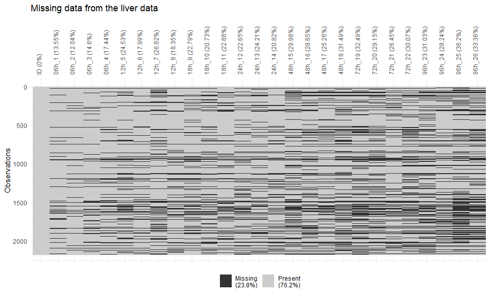<!-- -->

Random forest imputation was performed in order to run the linear
models.

## Random Forest Imputation

``` r
t_mat <- t(tomat_norm)


if(!file.exists(here::here("results/msstas_rds/liver_imputation_object.rds"))){
      
      cl <- makeCluster(8)
      
      t_matimp <- missForest::missForest(t_mat, parallelize = 'variables')
      
      write_rds(t_matimp, here::here("results/msstas_rds/liver_imputation_object.rds"))
      
      stopCluster(cl)
      
} else {
      t_matimp <- read_rds(here::here("results/msstas_rds/liver_imputation_object.rds"))
}

mat_imp <- t(t_matimp$ximp)

tab_wide_imp <- mat_imp %>% 
      as_tibble() %>%
      mutate(ID = row.names(mat_imp)) %>% 
      relocate(ID)

write_delim(x = tab_wide_imp, 
            file = here::here("results/msstats_log2_norm_expr_mat_ncro_liver_imputed.txt"),
            delim = "\t")
```

# Fitting linear models with `limma`

Three (3) types of models will be applied to pinpoint proteins with
three different behaviors across time.

  - Model 1: Time as a continuous variable: will identify proteins that
    either have linear ‘increased’ or ‘decreased’ behavior over time.
  - Model 2: Polynomial spline fitting with 2 degrees of freedom: will
    catch proteins that have a maximal or minimum peak at one time
    point.
  - Model 3: Polynomial spline fitting with 3 degrees of freedom: will
    catch proteins that have a ‘sigmoidal’ behavior across time.

<!-- end list -->

``` r
# Source functions to fit linear models and visualizations 
source(here::here("scr/function_fit_time_course_limma.R"))
```

### Load expression matrices

``` r
wide_imp <- read_delim(here::here("results/msstats_log2_norm_expr_mat_ncro_liver_imputed.txt"),
                       delim = "\t")

wide_dat <- read_delim(here::here("results/msstats_log2_proda_norm_expr_mat_ncro_liver.txt"),
                       delim = "\t")
```

## Model 1: Time as a continuous variable

``` r
fit_time_cont <- fit_limma_poly(type = "linear", 
                                .x = 2,
                                wide_imp = wide_imp, 
                                wide_dat = wide_dat,
                                pval_cutoff = 0.05)
```

### Design matrix

``` r
fit_time_cont$limma_fit$design
```

    ##        (Intercept) time
    ## 06h_1            1    6
    ## 06h_2            1    6
    ## 06h_3            1    6
    ## 06h_4            1    6
    ## 12h_5            1   12
    ## 12h_6            1   12
    ## 12h_7            1   12
    ## 12h_8            1   12
    ## 18h_9            1   18
    ## 18h_10           1   18
    ## 18h_11           1   18
    ## 24h_12           1   24
    ## 24h_13           1   24
    ## 24h_14           1   24
    ## 48h_15           1   48
    ## 48h_16           1   48
    ## 48h_17           1   48
    ## 48h_18           1   48
    ## 72h_19           1   72
    ## 72h_20           1   72
    ## 72h_21           1   72
    ## 72h_22           1   72
    ## 96h_23           1   96
    ## 96h_24           1   96
    ## 96h_25           1   96
    ## 96h_26           1   96
    ## attr(,"assign")
    ## [1] 0 1

### Histogram of distribution of adjusted p-values.

``` r
histogram_toptable(fit_time_cont$toptable,
                   type = "Linear",
                   .x = NULL)
```

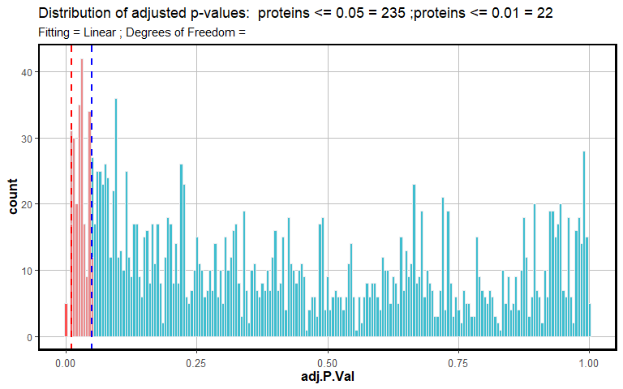<!-- -->

## Model 2: Polynomial spline fitting with 2 degrees of freedom

``` r
fit_spline_df2 <- fit_limma_poly(type = "spline", 
                                .x = 2,
                                wide_imp = wide_imp, 
                                wide_dat = wide_dat,
                                pval_cutoff = 0.05)
```

### Design matrix

``` r
fit_spline_df2$limma_fit$design
```

    ##        (Intercept)    cubic1      cubic2
    ## 06h_1            1 0.0000000  0.00000000
    ## 06h_2            1 0.0000000  0.00000000
    ## 06h_3            1 0.0000000  0.00000000
    ## 06h_4            1 0.0000000  0.00000000
    ## 12h_5            1 0.1327616 -0.07293338
    ## 12h_6            1 0.1327616 -0.07293338
    ## 12h_7            1 0.1327616 -0.07293338
    ## 12h_8            1 0.1327616 -0.07293338
    ## 18h_9            1 0.2569291 -0.13615400
    ## 18h_10           1 0.2569291 -0.13615400
    ## 18h_11           1 0.2569291 -0.13615400
    ## 24h_12           1 0.3639084 -0.17994912
    ## 24h_13           1 0.3639084 -0.17994912
    ## 24h_14           1 0.3639084 -0.17994912
    ## 48h_15           1 0.5626509 -0.09612291
    ## 48h_16           1 0.5626509 -0.09612291
    ## 48h_17           1 0.5626509 -0.09612291
    ## 48h_18           1 0.5626509 -0.09612291
    ## 72h_19           1 0.4863833  0.29851135
    ## 72h_20           1 0.4863833  0.29851135
    ## 72h_21           1 0.4863833  0.29851135
    ## 72h_22           1 0.4863833  0.29851135
    ## 96h_23           1 0.2726107  0.84854962
    ## 96h_24           1 0.2726107  0.84854962
    ## 96h_25           1 0.2726107  0.84854962
    ## 96h_26           1 0.2726107  0.84854962
    ## attr(,"assign")
    ## [1] 0 1 1

### Histogram of distribution of adjusted p-values.

``` r
histogram_toptable(fit_spline_df2$toptable,
                   type = "Spline",
                   .x = 2)
```

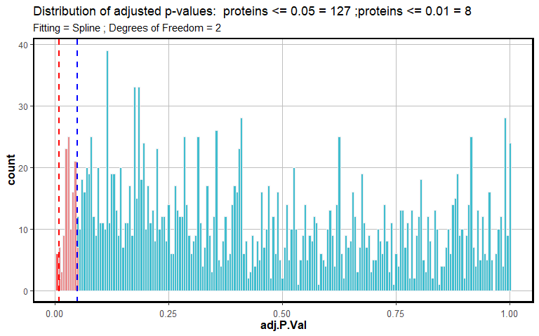<!-- -->

## Model 3: Polynomial spline fitting with 3 degrees of freedom

``` r
fit_spline_df3 <- fit_limma_poly(type = "spline", 
                                .x = 3,
                                wide_imp = wide_imp, 
                                wide_dat = wide_dat,  
                                pval_cutoff = 0.05)
```

### Design matrix

``` r
fit_spline_df3$limma_fit$design
```

    ##        (Intercept)      cubic1    cubic2     cubic3
    ## 06h_1            1  0.00000000 0.0000000  0.0000000
    ## 06h_2            1  0.00000000 0.0000000  0.0000000
    ## 06h_3            1  0.00000000 0.0000000  0.0000000
    ## 06h_4            1  0.00000000 0.0000000  0.0000000
    ## 12h_5            1 -0.09214064 0.2543692 -0.1574666
    ## 12h_6            1 -0.09214064 0.2543692 -0.1574666
    ## 12h_7            1 -0.09214064 0.2543692 -0.1574666
    ## 12h_8            1 -0.09214064 0.2543692 -0.1574666
    ## 18h_9            1 -0.13550396 0.4556979 -0.2820987
    ## 18h_10           1 -0.13550396 0.4556979 -0.2820987
    ## 18h_11           1 -0.13550396 0.4556979 -0.2820987
    ## 24h_12           1 -0.09470687 0.5639902 -0.3484042
    ## 24h_13           1 -0.09470687 0.5639902 -0.3484042
    ## 24h_14           1 -0.09470687 0.5639902 -0.3484042
    ## 48h_15           1  0.41226688 0.4408764 -0.1813484
    ## 48h_16           1  0.41226688 0.4408764 -0.1813484
    ## 48h_17           1  0.41226688 0.4408764 -0.1813484
    ## 48h_18           1  0.41226688 0.4408764 -0.1813484
    ## 72h_19           1  0.37052446 0.3427579  0.2456920
    ## 72h_20           1  0.37052446 0.3427579  0.2456920
    ## 72h_21           1  0.37052446 0.3427579  0.2456920
    ## 72h_22           1  0.37052446 0.3427579  0.2456920
    ## 96h_23           1 -0.15430267 0.4050445  0.7492582
    ## 96h_24           1 -0.15430267 0.4050445  0.7492582
    ## 96h_25           1 -0.15430267 0.4050445  0.7492582
    ## 96h_26           1 -0.15430267 0.4050445  0.7492582
    ## attr(,"assign")
    ## [1] 0 1 1 1

### Histogram of distribution of adjusted p-values.

``` r
histogram_toptable(fit_spline_df3$toptable,
                   type = "Spline",
                   .x = 3)
```

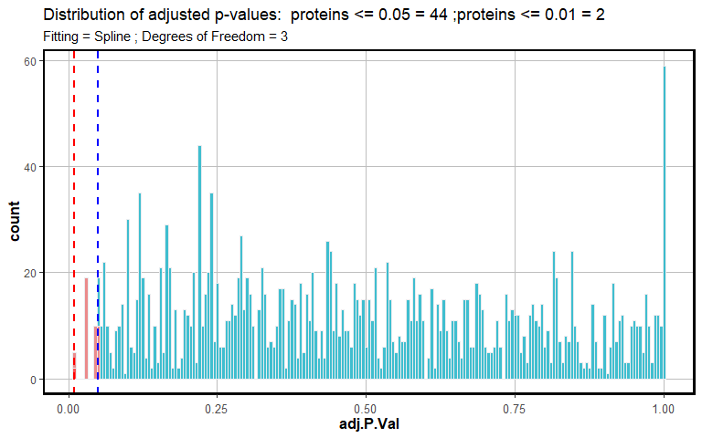<!-- -->

# Intersection analyses

The intersection analysis would allow to identify proteins that are
exclusively identified by one of the models/approaches.

### Prep list of proteins identified by each model/approach for the intersection analysis.

``` r
pot_degress <- c(2, 3)
names(pot_degress) <- paste0(rep("Degr"), pot_degress)

spline_prots <- map(.x = pot_degress, 
    .f = fit_limma_tocomp,
     type = "spline", wide_imp = wide_imp, wide_dat = wide_dat, pval_cutoff = 0.05)

names(spline_prots) <- paste0(rep("Spline_"),names(spline_prots))
```

``` r
linear_prots <- fit_limma_tocomp(.x = 1,
     type = "linear", wide_imp = wide_imp, wide_dat = wide_dat, pval_cutoff = 0.05)

linear_prots <- list(Linear = linear_prots)

large_list_1 <- c(spline_prots,
                  linear_prots)
```

## Upset plot for the intersection of proteins identified as associated with the regression models and an adjusted `p-value < 0.05`.

``` r
UpSetR::upset(UpSetR::fromList(large_list_1), nsets = 11, order.by = "freq")
```

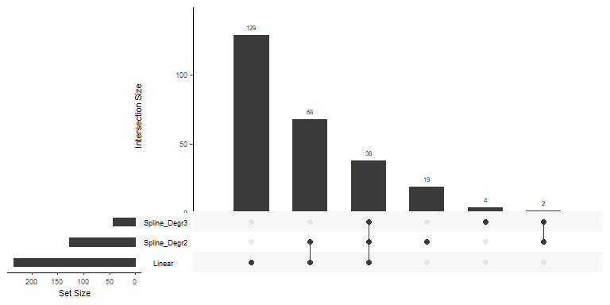<!-- -->

### Upset plots with `complexHeatmap` package are better for further processing the intersecting elements

``` r
comb_mat <- make_comb_mat(large_list_1, min_set_size = 1)
```

#### Combination matrix

``` r
print(comb_mat)
```

    ## A combination matrix with 3 sets and 6 combinations.
    ##   ranges of combination set size: c(2, 129).
    ##   mode for the combination size: distinct.
    ##   sets are on rows.
    ## 
    ## Combination sets are:
    ##   Spline_Degr2 Spline_Degr3 Linear code size
    ##              x            x      x  111   38
    ##              x            x         110    2
    ##              x                   x  101   68
    ##              x                      100   19
    ##                           x         010    4
    ##                                  x  001  129
    ## 
    ## Sets are:
    ##            set size
    ##   Spline_Degr2  127
    ##   Spline_Degr3   44
    ##         Linear  235

## Proteins that were detected by simple linear model and spline DF 2

These proteins are those that can be considered to have a linear
relationship with time, even if they were also detected by the spline DF
2 model.

``` r
only_linear <- c(extract_comb(comb_mat, "001"),extract_comb(comb_mat, "101"))
```

``` r
length(only_linear)
```

    ## [1] 197

### Proteins with positive relation with Time

``` r
pos_linear <- fit_time_cont$toptable %>% 
  filter(ID %in% only_linear,
         logFC > 0)

poslin_bitr <- clusterProfiler::bitr(pos_linear$ID,
                                     fromType = "UNIPROT",
                                     toType = "SYMBOL", 
                                     OrgDb = org.Hs.eg.db) %>% 
  dplyr::rename(ID = UNIPROT)

pos_linear <- left_join(pos_linear, poslin_bitr, by = "ID")
```

``` r
vis_profs(data = wide_dat, 
          toptable = pos_linear, 
          pval_cutoff = 0.05, 
          title1 = "Proteins with linear and positive association with Time",
          subtitle1 = "Top 18 proteins with the lowest adjusted p-value",
          top_nr = 18, 
          fited_values = fit_time_cont$fitted_values, 
          method = "lm",
          interesting = pos_linear$ID) + 
  labs(caption = "Lower p-values indicate a stronger association Protein Expression vs Time") 
```

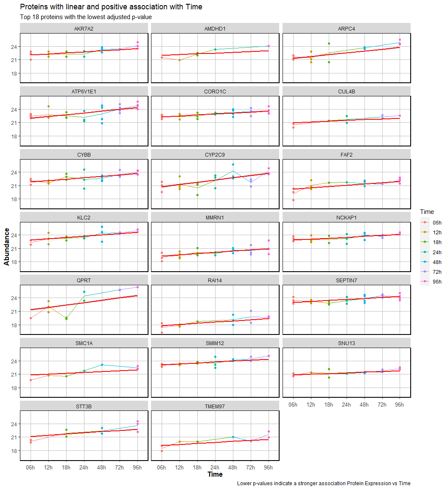<!-- -->

### Proteins with negative relation with Time

``` r
neg_linear <- fit_time_cont$toptable %>% 
  filter(ID %in% only_linear,
         logFC < 0)

neglin_bitr <- clusterProfiler::bitr(neg_linear$ID,
                                     fromType = "UNIPROT",
                                     toType = "SYMBOL", 
                                     OrgDb = org.Hs.eg.db) %>% 
  dplyr::rename(ID = UNIPROT)

neg_linear <- left_join(neg_linear, neglin_bitr, by = "ID")

neg_linear <- mutate(neg_linear,
                     SYMBOL = ifelse(is.na(SYMBOL),
                                     yes = ID,
                                     no = SYMBOL))
```

``` r
vis_profs(data = wide_dat, 
          toptable = neg_linear, 
          pval_cutoff = 0.05, 
          title1 = "Proteins with linear and negative association with Time",
          subtitle1 = "Top 18 proteins with the lowest adjusted p-value",
          top_nr = 18, 
          fited_values = fit_time_cont$fitted_values, 
          method = "lm",
          interesting = neg_linear$ID) + 
  labs(caption = "Lower p-values indicate a stronger association Protein Expression vs Time") 
```

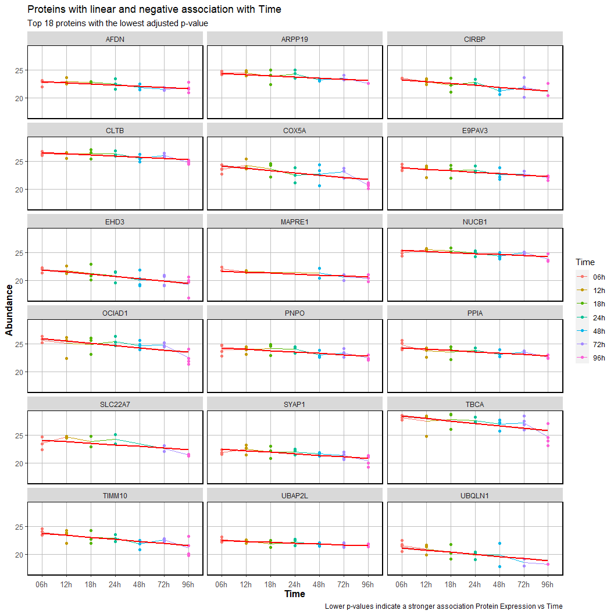<!-- -->

## Proteins that were detected only by splines with 2 DF

``` r
only_2DF <- extract_comb(comb_mat, "100")
```

``` r
length(only_2DF)
```

    ## [1] 19

``` r
df2_bitr <- clusterProfiler::bitr(fit_spline_df2$toptable$ID,
                                     fromType = "UNIPROT",
                                     toType = "SYMBOL", 
                                     OrgDb = org.Hs.eg.db) %>% 
  dplyr::rename(ID = UNIPROT)

fit_spline_df2$toptable <- left_join(fit_spline_df2$toptable, df2_bitr, by = "ID")
```

``` r
vis_profs(data = wide_dat, 
          toptable = fit_spline_df2$toptable, 
          pval_cutoff = 0.05, 
          title1 = "Proteins with spline fitting (2 DF)",
          subtitle1 = "Top 18 proteins with the lowest adjusted p-value",
          top_nr = 18, 
          fited_values = fit_spline_df2$fitted_values, 
          method = NULL,
          interesting = only_2DF) + 
  labs(caption = "Lower p-values indicate a stronger association Protein Expression vs Spline model") 
```

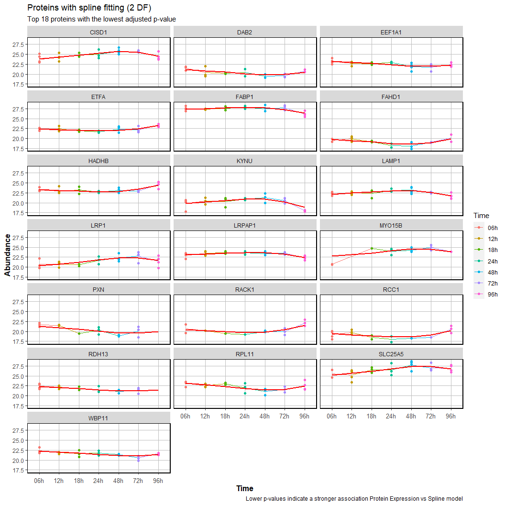<!-- -->

## Proteins that were detected only by splines with 2 and 3 DF

``` r
only_3n2DF <- c(extract_comb(comb_mat, "010"),extract_comb(comb_mat, "110"))
```

``` r
length(only_3n2DF)
```

    ## [1] 6

``` r
df3_bitr <- clusterProfiler::bitr(fit_spline_df3$toptable$ID,
                                     fromType = "UNIPROT",
                                     toType = "SYMBOL", 
                                     OrgDb = org.Hs.eg.db) %>% 
  dplyr::rename(ID = UNIPROT)

fit_spline_df3$toptable <- left_join(fit_spline_df3$toptable, df3_bitr, by = "ID")
```

``` r
vis_profs(data = wide_dat, 
          toptable = fit_spline_df3$toptable, 
          pval_cutoff = 0.05, 
          title1 = "Proteins with spline fitting (3 DF)",
          subtitle1 = "Top 18 proteins with the lowest adjusted p-value",
          top_nr = 18, 
          fited_values = fit_spline_df3$fitted_values, 
          method = NULL,
          interesting = only_3n2DF) + 
  labs(caption = "Lower p-values indicate a stronger association Protein Expression vs Spline model") 
```

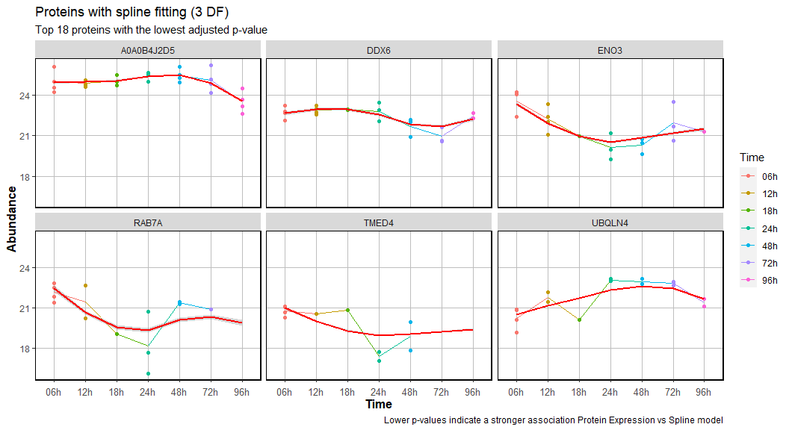<!-- -->

# Exploratory Functional annotation

In order to explore the functional annotation of the proteins detected
under different models, a ‘relaxed’ enrichment analysis was performed.

The adjusted p-value cut-off of the over-representation test was set to
`0.1` and for the universe of background proteins all human proteins
were kept.

``` r
selected_proteins <- list(`Positive linear` = pos_linear$ID,
                          `Negative linear` = neg_linear$ID,
                          `Spline 2DF` = only_2DF, 
                          `Spline 3DF` = only_3n2DF)
```

``` r
library(clusterProfiler)
library(ReactomePA)
library(org.Hs.eg.db)
```

## <GO:MF>

``` r
group_comparison_functional<- compareCluster(geneCluster = selected_proteins, 
                                             fun = "enrichGO",
                                             OrgDb = org.Hs.eg.db,
                                             keyType = "UNIPROT",
                                             ont = "MF",
                                             pvalueCutoff = 0.1,
                                             pAdjustMethod = "BH", 
                                             qvalueCutoff = 0.2,
                                             minGSSize = 10,
                                             maxGSSize = 500,
                                             readable = FALSE,
                                             pool = FALSE)
```

``` r
dotplot(group_comparison_functional)
```

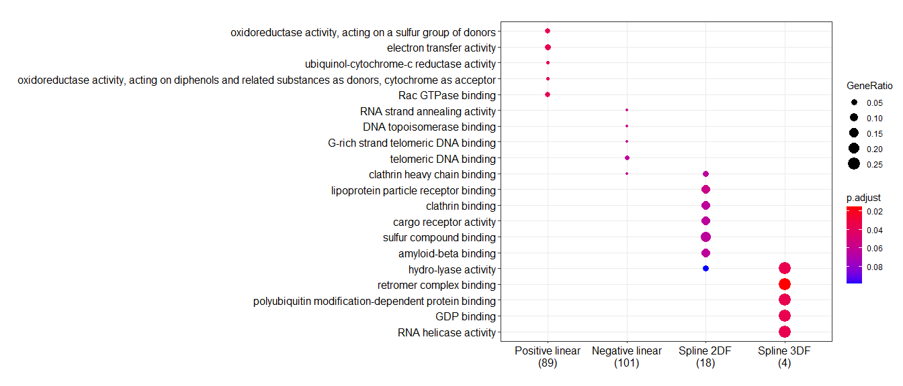<!-- -->

## <GO:CC>

``` r
group_comparison_functionalcc <- compareCluster(geneCluster = selected_proteins, 
                                             fun = "enrichGO",
                                             OrgDb = org.Hs.eg.db,
                                             keyType = "UNIPROT",
                                             ont = "CC",
                                             pvalueCutoff = 0.1,
                                             pAdjustMethod = "BH", 
                                             qvalueCutoff = 0.2,
                                             minGSSize = 10,
                                             maxGSSize = 500,
                                             readable = FALSE,
                                             pool = FALSE)
```

``` r
dotplot(group_comparison_functionalcc)
```

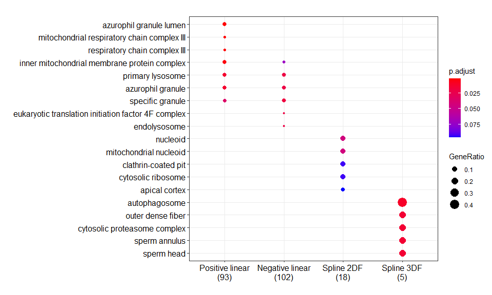<!-- -->

## <GO:BP>

``` r
group_comparison_functionalbp <- compareCluster(geneCluster = selected_proteins, 
                                             fun = "enrichGO",
                                             OrgDb = org.Hs.eg.db,
                                             keyType = "UNIPROT",
                                             ont = "BP",
                                             pvalueCutoff = 0.1,
                                             pAdjustMethod = "BH", 
                                             qvalueCutoff = 0.2,
                                             minGSSize = 10,
                                             maxGSSize = 500,
                                             readable = FALSE,
                                             pool = FALSE)
```

``` r
dotplot(group_comparison_functionalbp)
```

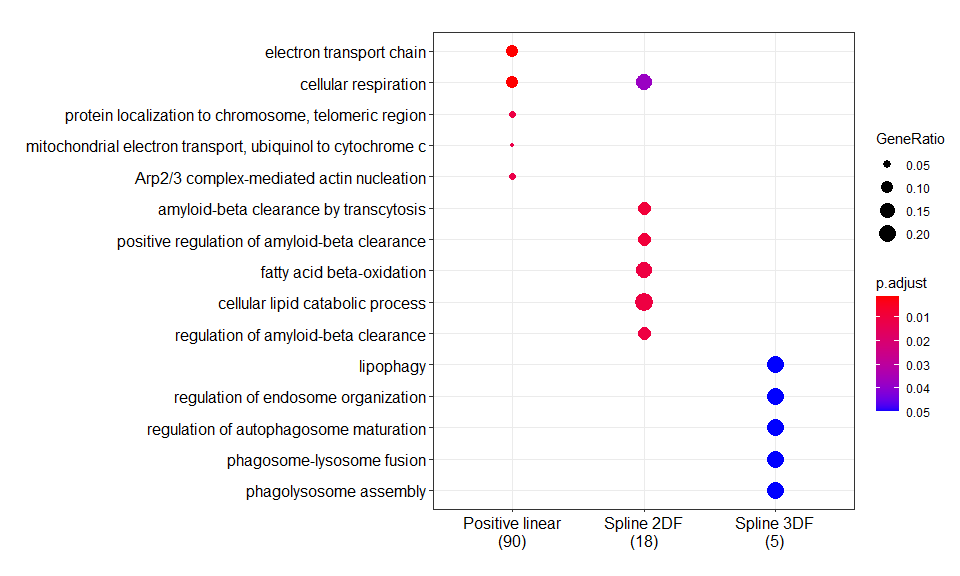<!-- -->

## Reactome

``` r
translate <- function(x){
  df1 <- bitr(geneID = x,
              fromType = "UNIPROT",
              toType = "ENTREZID",
              OrgDb = org.Hs.eg.db,
              drop = TRUE) %>% 
    pull(ENTREZID)
  
  return(df1)
}

selected_proteinsentrez <- map(selected_proteins,
                               translate)
```

``` r
group_comparison_functionalreac <- compareCluster(geneCluster = selected_proteinsentrez, 
                                             fun = "enrichPathway",
                                             organism = "human",
                                             pvalueCutoff = 0.1,
                                             pAdjustMethod = "BH", 
                                             qvalueCutoff = 0.2,
                                             minGSSize = 10,
                                             maxGSSize = 500,
                                             readable = FALSE)
```

``` r
dotplot(group_comparison_functionalreac)
```

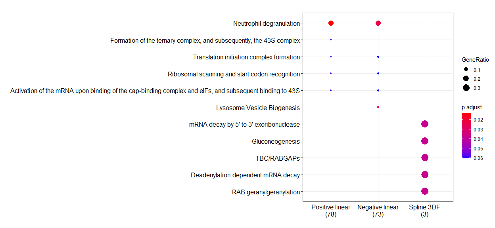<!-- -->
