Data analysis reproducible report - Retrospective Timing of Tissue
Storage by Kinetics of Proteome Alterations – The „Proteomic Clock”
Concept
================
Miguel Cosenza-Contreras
18 August, 2022

# Fitting linear models with `limma`

Three (3) types of models will be applied to pinpoint proteins with
three different behaviors across time.

-   Model 1: Time as a continuous variable: will identify proteins that
    either have linear ‘increased’ or ‘decreased’ behavior over time.
-   Model 2: Polynomial spline fitting with 2 degrees of freedom: will
    catch proteins that have a maximal or minimum peak at one time
    point.
-   Model 3: Polynomial spline fitting with 3 degrees of freedom: will
    catch proteins that have a ‘sigmoidal’ behavior across time.

# Functional enrichment based on non-adjusted p-values

For this report, the proteins selected as significantly associated with
time would be those that, after `limma` statistics, present a
non-adjusted p-value smaller than 0.05.

We focus on proteins that show a directly linear association with time
(not based on a spline model).

Furthermore, we perform functional and structural enrichment analyses on
these sets of proteins per tissue.

## Load expression matrices

### Liver

``` r
wide_imp_liv <- read_delim(here::here("results/msstats_log2_norm_expr_mat_ncro_liver_imputed.txt"),
                       delim = "\t")

wide_dat_liv <- read_delim(here::here("results/msstats_log2_proda_norm_expr_mat_ncro_liver.txt"),
                       delim = "\t")
```

#### Model 1: Time as a continuous variable

``` r
fit_time_cont_liv <- fit_limma_poly(type = "linear", 
                                    .x = 2,
                                    wide_imp = wide_imp_liv, 
                                    wide_dat = wide_dat_liv,
                                    pval_cutoff = 0.05)
```

##### Histogram of distribution of adjusted p-values.

``` r
histogram_toptable(fit_time_cont_liv$toptable,
                   type = "Linear",
                   .x = NULL)
```

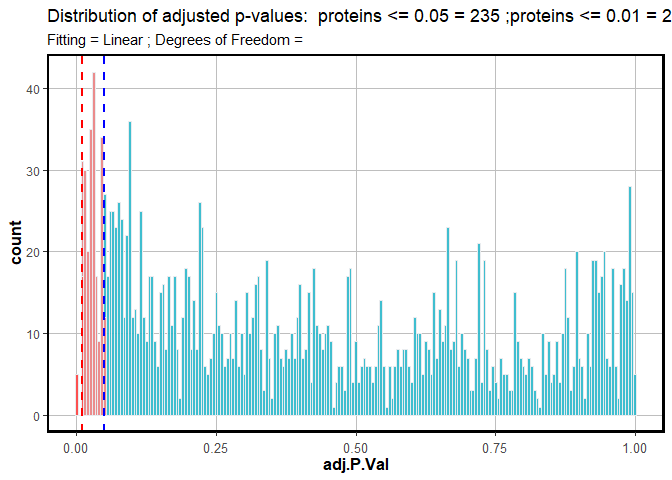<!-- -->

#### Model 2: Polynomial spline fitting with 2 degrees of freedom

``` r
fit_spline_df2_liv <- fit_limma_poly(type = "spline", 
                                     .x = 2,
                                     wide_imp = wide_imp_liv, 
                                     wide_dat = wide_dat_liv,
                                     pval_cutoff = 0.05)
```

##### Histogram of distribution of adjusted p-values.

``` r
histogram_toptable(fit_spline_df2_liv$toptable,
                   type = "Spline",
                   .x = 2)
```

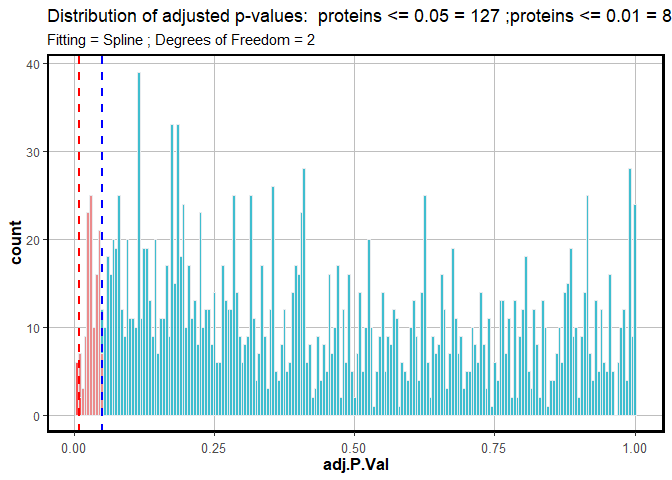<!-- -->

#### Model 3: Polynomial spline fitting with 3 degrees of freedom

``` r
fit_spline_df3_liv <- fit_limma_poly(type = "spline", 
                                     .x = 3,
                                     wide_imp = wide_imp_liv, 
                                     wide_dat = wide_dat_liv,  
                                     pval_cutoff = 0.05)
```

#### Intersection analyses

The intersection analysis would allow to identify proteins that are
exclusively identified by one of the models/approaches.

##### Prep list of proteins identified by each model/approach for the intersection analysis.

``` r
pot_degress <- c(2, 3)
names(pot_degress) <- paste0(rep("Degr"), pot_degress)

spline_prots_liv <- map(.x = pot_degress, 
    .f = fit_limma_tocomp,
     type = "spline", 
    wide_imp = wide_imp_liv, 
    wide_dat = wide_dat_liv, 
    pval_cutoff = 0.05)

names(spline_prots_liv) <- paste0(rep("Spline_"),names(spline_prots_liv))
```

``` r
linear_prots_liv <- fit_limma_tocomp(.x = 2,
                                     type = "linear", 
                                     wide_imp = wide_imp_liv, 
                                     wide_dat = wide_dat_liv, 
                                     pval_cutoff = 0.05)

linear_prots_liv <- list(Linear = linear_prots_liv)

large_list_1_liv <- c(spline_prots_liv,
                      linear_prots_liv)
```

##### Upset plot for the intersection of proteins identified as associated with the regression models and an adjusted `p-value < 0.05`.

``` r
UpSetR::upset(UpSetR::fromList(large_list_1_liv), 
              nsets = 11, 
              order.by = "freq")
```

<!-- -->

##### Upset plots with `complexHeatmap` package are better for further processing the intersecting elements

``` r
comb_mat_liv <- make_comb_mat(large_list_1_liv, 
                               min_set_size = 1)
```

##### Combination matrix

``` r
print(comb_mat_liv)
```

    ## A combination matrix with 3 sets and 6 combinations.
    ##   ranges of combination set size: c(2, 129).
    ##   mode for the combination size: distinct.
    ##   sets are on rows.
    ## 
    ## Combination sets are:
    ##   Spline_Degr2 Spline_Degr3 Linear code size
    ##              x            x      x  111   38
    ##              x            x         110    2
    ##              x                   x  101   68
    ##              x                      100   19
    ##                           x         010    4
    ##                                  x  001  129
    ## 
    ## Sets are:
    ##            set size
    ##   Spline_Degr2  127
    ##   Spline_Degr3   44
    ##         Linear  235

#### Proteins that were detected by simple linear model and spline DF 2

These proteins are those that can be considered to have a linear
relationship with time, even if they were also detected by the spline DF
2 model.

``` r
only_linear_liv <- c(extract_comb(comb_mat_liv, "001"),
                     extract_comb(comb_mat_liv, "101"))
```

``` r
length(only_linear_liv)
```

    ## [1] 197

### Proteins with positive relation with Time

``` r
pos_linear_liv <- fit_time_cont_liv$toptable %>% 
  dplyr::filter(adj.P.Val <= 0.05,
         logFC > 0)

poslin_bitr_liv <- clusterProfiler::bitr(pos_linear_liv$ID,
                                     fromType = "UNIPROT",
                                     toType = "SYMBOL", 
                                     OrgDb = org.Hs.eg.db) %>% 
  dplyr::rename(ID = UNIPROT)

pos_linear_liv <- left_join(pos_linear_liv, 
                            poslin_bitr_liv, by = "ID")
```

``` r
vis_profs_2(data = wide_dat_liv, 
          toptable = pos_linear_liv, 
          pval_cutoff = 0.05, 
          top_nr = 9, 
          fited_values = fit_time_cont_liv$fitted_values, 
          method = "lm",
          interesting = pos_linear_liv$ID,
          exclude = "Q9H993",
          leg_pos = "none")
```

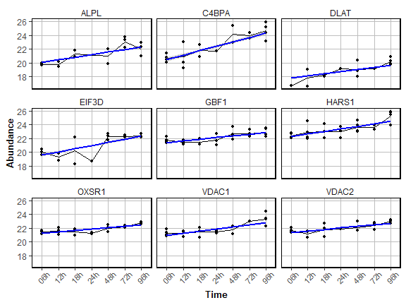<!-- -->

### Proteins with negative relation with Time

``` r
neg_linear_liv <- fit_time_cont_liv$toptable %>% 
  dplyr::filter(adj.P.Val <= 0.05,
         logFC < 0)

poslin_bitr_liv <- clusterProfiler::bitr(neg_linear_liv$ID,
                                     fromType = "UNIPROT",
                                     toType = "SYMBOL", 
                                     OrgDb = org.Hs.eg.db) %>% 
  dplyr::rename(ID = UNIPROT)

neg_linear_liv <- left_join(neg_linear_liv, poslin_bitr_liv, by = "ID")
```

``` r
vis_profs_2(data = wide_dat_liv, 
          toptable = neg_linear_liv, 
          pval_cutoff = 0.05, 
          top_nr = 9, 
          fited_values = fit_time_cont_liv$fitted_values, 
          method = "lm",
          interesting = neg_linear_liv$ID,
          leg_pos = "none") +
          theme(axis.text.x = element_text(hjust = 0.7, 
                                           vjust = 1, 
                                           size=8, 
                                           angle = 45),
                          panel.background = element_blank(),
                          panel.grid.major = element_line(color = "grey"),
                          panel.border = element_rect(colour = "black", 
                                                      fill=NA, 
                                                      size=1),
                          legend.position = "none",
                          axis.title.y = element_blank())
```

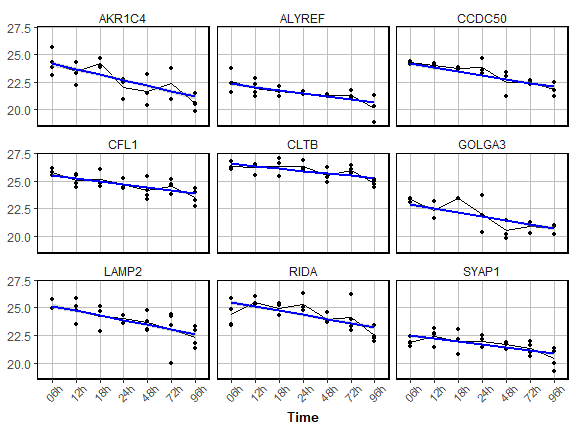<!-- -->

``` r
up_liv <- vis_profs_2(data = wide_dat_liv, 
          toptable = pos_linear_liv, 
          pval_cutoff = 0.05, 
          top_nr = 9, 
          fited_values = fit_time_cont_liv$fitted_values, 
          method = "lm",
          interesting = pos_linear_liv$ID,
          exclude = "Q9H993",
          leg_pos = "none")

down_liv <- vis_profs_2(data = wide_dat_liv, 
          toptable = neg_linear_liv, 
          pval_cutoff = 0.05, 
          top_nr = 9, 
          fited_values = fit_time_cont_liv$fitted_values, 
          method = "lm",
          interesting = neg_linear_liv$ID,
          leg_pos = "none") +
          theme(axis.text.x = element_text(hjust = 0.7, vjust = 1, size=8, angle = 45),
                          panel.background = element_blank(),
                          panel.grid.major = element_line(color = "grey"),
                          panel.border = element_rect(colour = "black", fill=NA, size=1),
                          legend.position = "none",
                          axis.title.y = element_blank())
```

``` r
cowplot::plot_grid(up_liv,down_liv, ncol = 2)
```

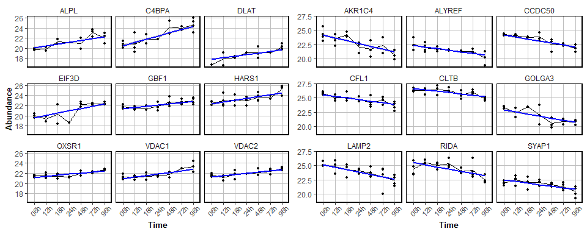<!-- -->

``` r
ggsave(plot = cowplot::plot_grid(up_liv,down_liv, ncol = 2), 
       filename = here::here("figures/top_proteins_liver.tiff"), 
       device = "tiff",
       units = "mm",
       width = 190,
       height = 80)
```

### Kidney

``` r
wide_imp_kid <- read_delim(here::here("results/msstats_log2_norm_expr_mat_ncro_kidney_imputed.txt"),
                       delim = "\t")

wide_dat_kid <- read_delim(here::here("results/msstats_log2_proda_norm_expr_mat_ncro_kidney.txt"),
                       delim = "\t")
```

#### Model 1: Time as a continuous variable

``` r
fit_time_cont_kid <- fit_limma_poly(type = "linear", 
                                .x = 2,
                                wide_imp = wide_imp_kid, 
                                wide_dat = wide_dat_kid,
                                pval_cutoff = 0.05)
```

##### Histogram of distribution of adjusted p-values.

``` r
histogram_toptable(fit_time_cont_kid$toptable,
                   type = "Linear",
                   .x = NULL)
```

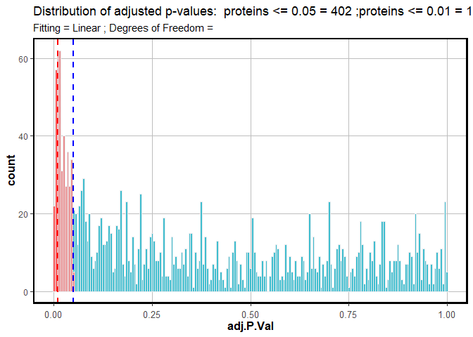<!-- -->

#### Model 2: Polynomial spline fitting with 2 degrees of freedom

``` r
fit_spline_df2_kid <- fit_limma_poly(type = "spline", 
                                .x = 2,
                                wide_imp = wide_imp_kid, 
                                wide_dat = wide_dat_kid,
                                pval_cutoff = 0.05)
```

##### Histogram of distribution of adjusted p-values.

``` r
histogram_toptable(fit_spline_df2_kid$toptable,
                   type = "Spline",
                   .x = 2)
```

<!-- -->

#### Model 3: Polynomial spline fitting with 3 degrees of freedom

``` r
fit_spline_df3_kid <- fit_limma_poly(type = "spline", 
                                .x = 3,
                                wide_imp = wide_imp_kid, 
                                wide_dat = wide_dat_kid,  
                                pval_cutoff = 0.05)
```

#### Intersection analyses

The intersection analysis would allow to identify proteins that are
exclusively identified by one of the models/approaches.

##### Prep list of proteins identified by each model/approach for the intersection analysis.

``` r
pot_degress <- c(2, 3)
names(pot_degress) <- paste0(rep("Degr"), pot_degress)

spline_prots_kid <- map(.x = pot_degress, 
    .f = fit_limma_tocomp,
     type = "spline", wide_imp = wide_imp_kid, wide_dat = wide_dat_kid, pval_cutoff = 0.05)

names(spline_prots_kid) <- paste0(rep("Spline_"),names(spline_prots_kid))
```

``` r
linear_prots_kid <- fit_limma_tocomp(.x = 2,
                                     type = "linear", 
                                     wide_imp = wide_imp_kid, 
                                     wide_dat = wide_dat_kid,
                                     pval_cutoff = 0.05)

linear_prots_kid <- list(Linear = linear_prots_kid)

large_list_1_kid <- c(spline_prots_kid,
                      linear_prots_kid)
```

##### Upset plot for the intersection of proteins identified as associated with the regression models and an adjusted `p-value < 0.05`.

``` r
UpSetR::upset(UpSetR::fromList(large_list_1_kid), nsets = 11, order.by = "freq")
```

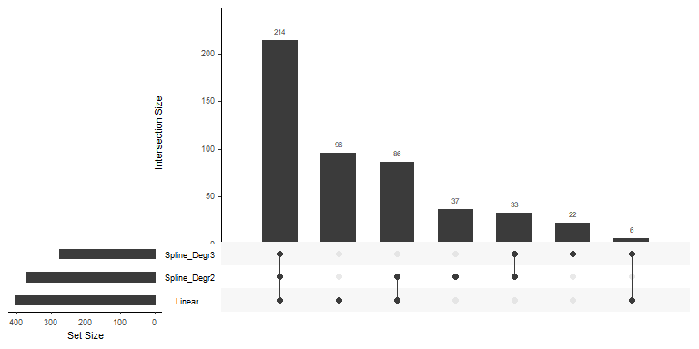<!-- -->

##### Upset plots with `complexHeatmap` package are better for further processing the intersecting elements

``` r
comb_mat_kid <- make_comb_mat(large_list_1_kid, min_set_size = 1)
```

##### Combination matrix

``` r
print(comb_mat_kid)
```

    ## A combination matrix with 3 sets and 7 combinations.
    ##   ranges of combination set size: c(6, 214).
    ##   mode for the combination size: distinct.
    ##   sets are on rows.
    ## 
    ## Combination sets are:
    ##   Spline_Degr2 Spline_Degr3 Linear code size
    ##              x            x      x  111  214
    ##              x            x         110   33
    ##              x                   x  101   86
    ##                           x      x  011    6
    ##              x                      100   37
    ##                           x         010   22
    ##                                  x  001   96
    ## 
    ## Sets are:
    ##            set size
    ##   Spline_Degr2  370
    ##   Spline_Degr3  275
    ##         Linear  402

#### Proteins that were detected by simple linear model and spline DF 2

These proteins are those that can be considered to have a linear
relationship with time, even if they were also detected by the spline DF
2 model.

``` r
only_linear_kid <- c(extract_comb(comb_mat_kid, "001"),
                     extract_comb(comb_mat_kid, "101"))
```

``` r
length(only_linear_kid)
```

    ## [1] 182

### Proteins with positive relation with Time

``` r
pos_linear_kid <- fit_time_cont_kid$toptable %>% 
  dplyr::filter(ID %in% only_linear_kid,
         logFC > 0)

poslin_bitr_kid <- clusterProfiler::bitr(pos_linear_kid$ID,
                                     fromType = "UNIPROT",
                                     toType = "SYMBOL", 
                                     OrgDb = org.Hs.eg.db) %>% 
  dplyr::rename(ID = UNIPROT)

pos_linear_kid <- left_join(pos_linear_kid, poslin_bitr_kid, by = "ID")
```

``` r
vis_profs_2(data = wide_dat_kid, 
          toptable = pos_linear_kid, 
          pval_cutoff = 0.05, 
          top_nr = 9, 
          fited_values = fit_time_cont_kid$fitted_values, 
          method = "lm",
          interesting = pos_linear_kid$ID,
          leg_pos = "none")
```

<!-- -->

### Proteins with negative relation with Time

``` r
neg_linear_kid <- fit_time_cont_kid$toptable %>% 
  dplyr::filter(ID %in% only_linear_kid,
         logFC < 0)

poslin_bitr_kid <- clusterProfiler::bitr(neg_linear_kid$ID,
                                     fromType = "UNIPROT",
                                     toType = "SYMBOL", 
                                     OrgDb = org.Hs.eg.db) %>% 
  dplyr::rename(ID = UNIPROT)

neg_linear_kid <- left_join(neg_linear_kid, poslin_bitr_kid, by = "ID")
```

``` r
vis_profs_2(data = wide_dat_kid, 
          toptable = neg_linear_kid, 
          pval_cutoff = 0.05, 
          top_nr = 9, 
          fited_values = fit_time_cont_kid$fitted_values, 
          method = "lm",
          interesting = neg_linear_kid$ID,
          leg_pos = "none") +
          theme(axis.text.x = element_text(hjust = 0.7, vjust = 1, size=8, angle = 45),
                          panel.background = element_blank(),
                          panel.grid.major = element_line(color = "grey"),
                          panel.border = element_rect(colour = "black", fill=NA, size=1),
                          legend.position = "none",
                          axis.title.y = element_blank())
```

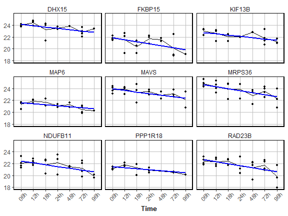<!-- -->

``` r
up_kid <- vis_profs_2(data = wide_dat_kid, 
          toptable = pos_linear_kid, 
          pval_cutoff = 0.05, 
          top_nr = 9, 
          fited_values = fit_time_cont_kid$fitted_values, 
          method = "lm",
          interesting = pos_linear_kid$ID,
          leg_pos = "none")

down_kid <- vis_profs_2(data = wide_dat_kid, 
          toptable = neg_linear_kid, 
          pval_cutoff = 0.05, 
          top_nr = 9, 
          fited_values = fit_time_cont_kid$fitted_values, 
          method = "lm",
          interesting = neg_linear_kid$ID,
          leg_pos = "none") +
          theme(axis.text.x = element_text(hjust = 0.7, vjust = 1, size=8, angle = 45),
                          panel.background = element_blank(),
                          panel.grid.major = element_line(color = "grey"),
                          panel.border = element_rect(colour = "black", fill=NA, size=1),
                          legend.position = "none",
                          axis.title.y = element_blank())
```

``` r
cowplot::plot_grid(up_kid,down_kid, ncol = 2)
```

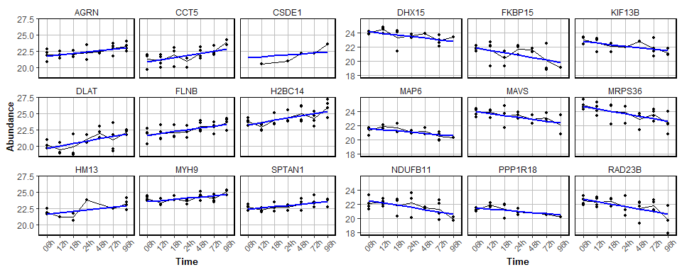<!-- -->

``` r
ggsave(plot = cowplot::plot_grid(up_kid,down_kid, ncol = 2), 
       filename = here::here("figures/top_proteins_kidney.tiff"), 
       device = "tiff",
       units = "mm",
       width = 190,
       height = 80)
```

### Lung

``` r
wide_imp_lun <- read_delim(here::here("results/msstats_log2_norm_expr_mat_ncro_lung_imputed.txt"),
                       delim = "\t")

wide_dat_lun <- read_delim(here::here("results/msstats_log2_proda_norm_expr_mat_ncro_lung.txt"),
                       delim = "\t")
```

#### Model 1: Time as a continuous variable

``` r
fit_time_cont_lun <- fit_limma_poly(type = "linear", 
                                .x = 2,
                                wide_imp = wide_imp_lun, 
                                wide_dat = wide_dat_lun,
                                pval_cutoff = 0.05)
```

##### Histogram of distribution of adjusted p-values.

``` r
histogram_toptable(fit_time_cont_lun$toptable,
                   type = "Linear",
                   .x = NULL)
```

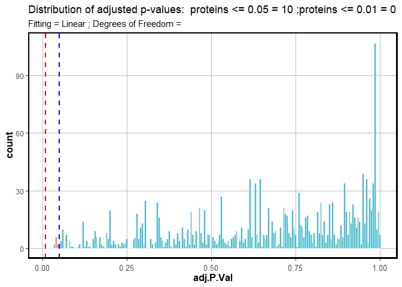<!-- -->

#### Model 2: Polynomial spline fitting with 2 degrees of freedom

``` r
fit_spline_df2_lun <- fit_limma_poly(type = "spline", 
                                .x = 2,
                                wide_imp = wide_imp_lun, 
                                wide_dat = wide_dat_lun,
                                pval_cutoff = 0.05)
```

##### Histogram of distribution of adjusted p-values.

``` r
histogram_toptable(fit_spline_df2_lun$toptable,
                   type = "Spline",
                   .x = 2)
```

<!-- -->

#### Model 3: Polynomial spline fitting with 3 degrees of freedom

``` r
fit_spline_df3_lun <- fit_limma_poly(type = "spline", 
                                .x = 3,
                                wide_imp = wide_imp_lun, 
                                wide_dat = wide_dat_lun,  
                                pval_cutoff = 0.05)
```

#### Intersection analyses

The intersection analysis would allow to identify proteins that are
exclusively identified by one of the models/approaches.

##### Prep list of proteins identified by each model/approach for the intersection analysis.

``` r
pot_degress <- c(2, 3)
names(pot_degress) <- paste0(rep("Degr"), pot_degress)

spline_prots_lun <- map(.x = pot_degress, 
    .f = fit_limma_tocomp,
     type = "spline", 
    wide_imp = wide_imp_lun, 
    wide_dat = wide_dat_lun, 
    pval_cutoff = 0.05)

names(spline_prots_lun) <- paste0(rep("Spline_"),names(spline_prots_lun))
```

``` r
linear_prots_lun <- fit_limma_tocomp(.x = 1,
     type = "linear", wide_imp = wide_imp_lun, wide_dat = wide_dat_lun, pval_cutoff = 0.05)

linear_prots_lun <- list(Linear = linear_prots_lun)

large_list_1_lun <- c(spline_prots_lun,
                      linear_prots_lun)
```

##### Upset plot for the intersection of proteins identified as associated with the regression models and an adjusted `p-value < 0.05`.

``` r
UpSetR::upset(UpSetR::fromList(large_list_1_lun), nsets = 11, order.by = "freq")
```

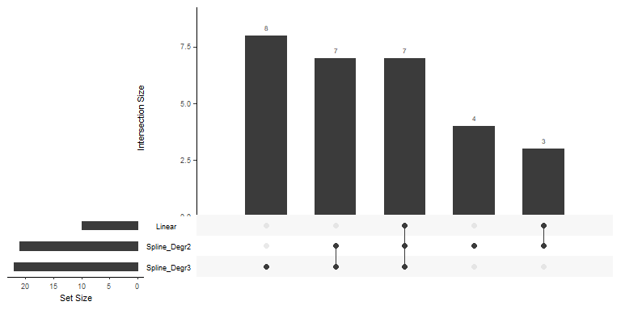<!-- -->

##### Upset plots with `complexHeatmap` package are better for further processing the intersecting elements

``` r
comb_mat_lun <- make_comb_mat(large_list_1_lun, min_set_size = 1)
```

##### Combination matrix

``` r
print(comb_mat_lun)
```

    ## A combination matrix with 3 sets and 5 combinations.
    ##   ranges of combination set size: c(3, 8).
    ##   mode for the combination size: distinct.
    ##   sets are on rows.
    ## 
    ## Combination sets are:
    ##   Spline_Degr2 Spline_Degr3 Linear code size
    ##              x            x      x  111    7
    ##              x            x         110    7
    ##              x                   x  101    3
    ##              x                      100    4
    ##                           x         010    8
    ## 
    ## Sets are:
    ##            set size
    ##   Spline_Degr2   21
    ##   Spline_Degr3   22
    ##         Linear   10

#### Proteins that were detected by simple linear model and spline DF 2

These proteins are those that can be considered to have a linear
relationship with time, even if they were also detected by the spline DF
2 model.

``` r
only_linear_lun <- c(extract_comb(comb_mat_lun, "101"),
                     #extract_comb(comb_mat_lun, "100"),
                 extract_comb(comb_mat_lun, "111"))
```

``` r
length(only_linear_lun)
```

    ## [1] 10

### Proteins with positive relation with Time

``` r
pos_linear_lun <- fit_time_cont_lun$toptable %>% 
  filter(adj.P.Val <= 0.05, # try adj.P.Val <= 0.05 / ID %in% only_linear_lun
         logFC > 0)

poslin_bitr_lun <- clusterProfiler::bitr(pos_linear_lun$ID,
                                     fromType = "UNIPROT",
                                     toType = "SYMBOL", 
                                     OrgDb = org.Hs.eg.db) %>% 
  dplyr::rename(ID = UNIPROT)

pos_linear_lun <- left_join(pos_linear_lun, poslin_bitr_lun, by = "ID")
```

``` r
vis_profs_2(data = wide_dat_lun, 
          toptable = pos_linear_lun, 
          pval_cutoff = 0.05, 
          top_nr = 9, 
          fited_values = fit_time_cont_lun$fitted_values, 
          method = "lm",
          interesting = pos_linear_lun$ID,
          leg_pos = "none")
```

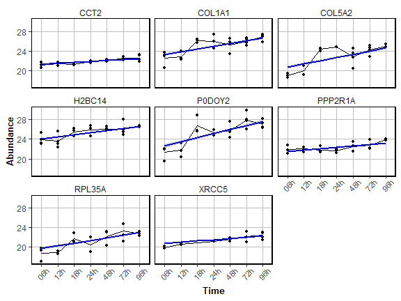<!-- -->

### Proteins with negative relation with Time

``` r
neg_linear_lun <- fit_time_cont_lun$toptable %>% 
  filter(ID %in% only_linear_lun,
         logFC < 0)

poslin_bitr_lun <- clusterProfiler::bitr(neg_linear_lun$ID,
                                     fromType = "UNIPROT",
                                     toType = "SYMBOL", 
                                     OrgDb = org.Hs.eg.db) %>% 
  dplyr::rename(ID = UNIPROT)

neg_linear_lun <- left_join(neg_linear_lun, poslin_bitr_lun, by = "ID")
```

``` r
vis_profs_2(data = wide_dat_lun, 
          toptable = neg_linear_lun, 
          pval_cutoff = 0.05, 
          top_nr = 9, 
          fited_values = fit_time_cont_lun$fitted_values, 
          method = "lm",
          interesting = neg_linear_lun$ID,
          leg_pos = "none") +
          theme(axis.text.x = element_text(hjust = 0.7, vjust = 1, size=8, angle = 45),
                          panel.background = element_blank(),
                          panel.grid.major = element_line(color = "grey"),
                          panel.border = element_rect(colour = "black", fill=NA, size=1),
                          legend.position = "none",
                          axis.title.y = element_blank())
```

<!-- -->

``` r
up_lun <- vis_profs_2(data = wide_dat_lun, 
          toptable = pos_linear_lun, 
          pval_cutoff = 0.05, 
          top_nr = 9, 
          fited_values = fit_time_cont_lun$fitted_values, 
          method = "lm",
          interesting = pos_linear_lun$ID,
          leg_pos = "none")

down_lun <- vis_profs_2(data = wide_dat_lun, 
          toptable = neg_linear_lun, 
          pval_cutoff = 0.05, 
          top_nr = 9, 
          fited_values = fit_time_cont_lun$fitted_values, 
          method = "lm",
          interesting = neg_linear_lun$ID,
          leg_pos = "none") +
          theme(axis.text.x = element_text(hjust = 0.7, vjust = 1, size=8, angle = 45),
                          panel.background = element_blank(),
                          panel.grid.major = element_line(color = "grey"),
                          panel.border = element_rect(colour = "black", fill=NA, size=1),
                          legend.position = "none",
                          axis.title.y = element_blank())
```

``` r
cowplot::plot_grid(up_lun,down_lun, ncol = 2, rel_heights = c(10,0.5))
```

<!-- -->

``` r
ggsave(plot = cowplot::plot_grid(up_lun,down_lun, ncol = 2), 
       filename = here::here("figures/top_proteins_lung.tiff"), 
       device = "tiff",
       units = "mm",
       width = 190,
       height = 80)
```

## Tabular results from limma

``` r
top_table_liver <- bind_rows(fit_time_cont_liv$toptable %>% mutate(organ = "liver")) %>%
          dplyr::filter(P.Value <= 0.05) %>%
          mutate(Time_relation = case_when(logFC < 0 ~ "decreased",
                                               logFC > 0 ~ "pseudo-enriched"))

top_table_kidney <- bind_rows(fit_time_cont_kid$toptable %>% mutate(organ = "kidney")) %>%
          dplyr::filter(P.Value <= 0.05) %>%
          mutate(Time_relation = case_when(logFC < 0 ~ "decreased",
                                               logFC > 0 ~ "pseudo-enriched"))

top_table_lung <- bind_rows(fit_time_cont_lun$toptable %>% mutate(organ = "lung")) %>%
          dplyr::filter(P.Value <= 0.05) %>%
          mutate(Time_relation = case_when(logFC < 0 ~ "decreased",
                                               logFC > 0 ~ "pseudo-enriched"))

# general table

top_table_general <- bind_rows(top_table_kidney,
                               top_table_liver,
                               top_table_lung)

# get gene symbols from uniprot IDs

toptable_bitr <- clusterProfiler::bitr(top_table_general$ID,
                                     fromType = "UNIPROT",
                                     toType = "SYMBOL", 
                                     OrgDb = org.Hs.eg.db) %>% 
  dplyr::rename(ID = UNIPROT)

# apend gene symbols to general top table

top_table_final <- left_join(top_table_general, toptable_bitr) %>% 
          dplyr::rename(UNIPROT_ID = ID)
```

# Functional enrichment analysis

Tests for the functional enrichment analysis of proteins identified as
decreased or ‘pseudo-enriched’ in relation with time.

In this approach, the enrichment will be performed on proteins from each
tissue separately, using the identified proteins of each tissue as
background.

``` r
library(clusterProfiler)
library(ReactomePA)
library(org.Hs.eg.db)
```

## Functional enrichment Liver

**Select interesting liver proteins**

``` r
universe_liver <- wide_dat_liv$ID %>% 
          unique()
```

### <GO:CC> - Liver

``` r
func_enrich_liver_cc <- compareCluster(ID~Time_relation, 
                                              data=top_table_liver, 
                                              fun="enrichGO",
                                              OrgDb = org.Hs.eg.db,
                                              keyType = "UNIPROT",
                                              ont = "CC",
                                              pvalueCutoff = 0.05,
                                              pAdjustMethod = "BH", 
                                              qvalueCutoff = 0.2,
                                              minGSSize = 10,
                                              maxGSSize = 800,
                                              readable = FALSE,
                                              pool = FALSE,
                                              universe = universe_liver)

func_enrich_liver_cc_sim <- simplify(func_enrich_liver_cc)
```

``` r
go_cc_dotplot <- enrichplot::dotplot(func_enrich_liver_cc_sim, x = "Time_relation") +
          xlab("Time relationship") +
          theme(axis.text.x = element_text(hjust = 0.7, vjust = 0.8, 
                                           size = 6, angle = 35),
                axis.text.y = element_text(size=6),
                panel.background = element_blank(),
                panel.grid.major = element_line(color = "grey"),
                panel.border = element_rect(colour = "black", fill=NA, size=1),
                #legend.position = "none",
                axis.title.y = element_blank(),
                axis.title=element_text(size=6,face="bold"),
                          strip.background = element_blank(),
                          strip.text.x = element_text(size = 12, 
                                                      margin = margin(3,3,3,3, 
                                                                      "mm")))
```

``` r
ggsave(plot = go_cc_dotplot, 
       filename = here::here("figures/enrichment_dotplot_plot_liverCC.tiff"), 
       device = "tiff",
       units = "mm",
       width = 85,
       height = 70)
```

``` r
ggsave(plot = go_cc_dotplot, 
       filename = here::here("figures/enrichment_dotplot_plot_liverCC.eps"), 
       device = "eps",
       units = "mm",
       width = 85,
       height = 70)
```

### <GO:BP> - Liver

``` r
func_enrich_liver_bp <- compareCluster(ID~Time_relation, 
                                       data=top_table_liver, 
                                       fun="enrichGO",
                                       OrgDb = org.Hs.eg.db,
                                       keyType = "UNIPROT",
                                       ont = "BP",
                                       pvalueCutoff = 0.05,
                                       pAdjustMethod = "BH", 
                                       qvalueCutoff = 0.2,
                                       minGSSize = 10,
                                       maxGSSize = 800,
                                       readable = FALSE,
                                       pool = FALSE,
                                       universe = universe_liver)

func_enrich_liver_bp_sim <- simplify(func_enrich_liver_bp)
```

    ## Error in (function (classes, fdef, mtable) : unable to find an inherited method for function 'simplify' for signature '"NULL"'

### Structural domain-based enrichment

#### Mapping proteins to domains

Here we will use all identified proteins to map their annotated domain
information for enrichment analysis.

``` r
library(ensembldb)
library(EnsDb.Hsapiens.v86)

edb <- EnsDb.Hsapiens.v86


## Genes mapping ----

universe_ids <- c(wide_imp_liv$ID %>% unique(),
                  wide_imp_kid$ID %>% unique(),
                  wide_imp_lun$ID %>% unique())


proteins <- filter(edb,
                   filter = UniprotFilter(universe_ids))

domainsdf <- ensembldb::select(proteins,
                  keys = UniprotFilter(universe_ids),
                  columns = c("SYMBOL", 
                              "UNIPROTID",
                              "PROTEINID",
                              "PROTEINDOMAINID",  
                              "PROTEINDOMAINSOURCE",
                              "PROTDOMSTART", 
                              "PROTDOMEND",
                              "UNIPROTMAPPINGTYPE",
                              "TXNAME",
                              "TXBIOTYPE"),
                  keytype = "UNIPROTID")

dom_supfam <- dplyr::filter(domainsdf,
                          PROTEINDOMAINSOURCE == "superfamily")
 

supfam2protein_id <- dplyr::select(dom_supfam,
                                 supfam_dom = PROTEINDOMAINID,
                                 geneID = UNIPROTID)#
```

#### Super family

``` r
func_enrich_liver_supfam <- compareCluster(ID~Time_relation, 
                                       data=top_table_liver, 
                                       fun="enricher",
                                       pvalueCutoff = 0.05,
                                       pAdjustMethod = "BH", 
                                       qvalueCutoff = 0.2,
                                       minGSSize = 10,
                                       maxGSSize = 800,
                                       universe = universe_liver,
                                       TERM2GENE = supfam2protein_id)
```

## Functional enrichment Kidney

**Select interesting liver proteins**

``` r
universe_kidney <- wide_dat_kid$ID %>% 
          unique()
```

### <GO:CC> - Kidney

``` r
func_enrich_kidney_cc <- compareCluster(ID~Time_relation, 
                                              data=top_table_kidney, 
                                              fun="enrichGO",
                                              OrgDb = org.Hs.eg.db,
                                              keyType = "UNIPROT",
                                              ont = "CC",
                                              pvalueCutoff = 0.05,
                                              pAdjustMethod = "BH", 
                                              qvalueCutoff = 0.2,
                                              minGSSize = 10,
                                              maxGSSize = 800,
                                              readable = FALSE,
                                              pool = FALSE,
                                              universe = universe_kidney)

func_enrich_kidney_cc_sim <- simplify(func_enrich_kidney_cc)
```

``` r
go_cc_dotplot_kid <- enrichplot::dotplot(func_enrich_kidney_cc_sim, 
                                         x = "Time_relation") +
          xlab("Time relationship") +
          theme(axis.text.x = element_text(hjust = 0.7, vjust = 0.8, size=8, angle = 35),
                axis.text.y = element_text(size=6),
                panel.background = element_blank(),
                panel.grid.major = element_line(color = "grey"),
                panel.border = element_rect(colour = "black", fill=NA, size=1),
                #legend.position = "none",
                axis.title.y = element_blank(),
                axis.title=element_text(size=6,face="bold"),
                          strip.background = element_blank(),
                          strip.text.x = element_text(size = 12, 
                                                      margin = margin(3,3,3,3, 
                                                                      "mm")))
```

``` r
go_cc_dotplot_kid
```

<!-- -->

``` r
ggsave(plot = go_cc_dotplot_kid, 
       filename = here::here("figures/enrichment_dotplot_plot_kidneyCC.tiff"), 
       device = "tiff",
       units = "mm",
       width = 85,
       height = 70)
```

``` r
ggsave(plot = go_cc_dotplot_kid, 
       filename = here::here("figures/enrichment_dotplot_plot_kidneyCC.eps"), 
       device = "eps",
       units = "mm",
       width = 85,
       height = 70)
```

### <GO:BP> - Kidney

``` r
func_enrich_kidney_bp <- compareCluster(ID~Time_relation, 
                                       data=top_table_kidney, 
                                       fun="enrichGO",
                                       OrgDb = org.Hs.eg.db,
                                       keyType = "UNIPROT",
                                       ont = "BP",
                                       pvalueCutoff = 0.05,
                                       pAdjustMethod = "BH", 
                                       qvalueCutoff = 0.2,
                                       minGSSize = 10,
                                       maxGSSize = 800,
                                       readable = FALSE,
                                       pool = FALSE,
                                       universe = universe_kidney)

func_enrich_kidney_bp_sim <- simplify(func_enrich_kidney_bp)
```

``` r
go_bp_dotplot_kid <- enrichplot::dotplot(func_enrich_kidney_bp_sim, x = "Time_relation") +
          xlab("Time relationship") +
          theme(axis.text.x = element_text(hjust = 0.7, vjust = 0.8, size=8, angle = 35),
                axis.text.y = element_text(size=6),
                panel.background = element_blank(),
                panel.grid.major = element_line(color = "grey"),
                panel.border = element_rect(colour = "black", fill=NA, size=1),
                #legend.position = "none",
                axis.title.y = element_blank(),
                axis.title=element_text(size=6,face="bold"),
                          strip.background = element_blank(),
                          strip.text.x = element_text(size = 12, 
                                                      margin = margin(3,3,3,3, "mm")))
```

``` r
go_bp_dotplot_kid
```

<!-- -->

``` r
ggsave(plot = go_bp_dotplot_kid, 
       filename = here::here("figures/enrichment_dotplot_plot_kidneyBP.tiff"), 
       device = "tiff",
       units = "mm",
       width = 85,
       height = 70)
```

``` r
ggsave(plot = go_bp_dotplot_kid, 
       filename = here::here("figures/enrichment_dotplot_plot_kidneyBP.eps"), 
       device = "eps",
       units = "mm",
       width = 85,
       height = 70)
```

### Structural domain-based enrichment

#### Mapping proteins to domains

#### Super family

``` r
func_enrich_kidney_supfam <- compareCluster(ID~Time_relation, 
                                       data=top_table_kidney, 
                                       fun="enricher",
                                       pvalueCutoff = 0.05,
                                       pAdjustMethod = "BH", 
                                       qvalueCutoff = 0.2,
                                       minGSSize = 10,
                                       maxGSSize = 800,
                                       universe = universe_kidney,
                                       TERM2GENE = supfam2protein_id)
```

``` r
supfam_dotplot_kid <- enrichplot::dotplot(func_enrich_kidney_supfam, x = "Time_relation") +
          xlab("Time relationship") +
          theme(axis.text.x = element_text(hjust = 0.7, vjust = 0.8, size=8, angle = 35),
                axis.text.y = element_text(size=6),
                panel.background = element_blank(),
                panel.grid.major = element_line(color = "grey"),
                panel.border = element_rect(colour = "black", fill=NA, size=1),
                #legend.position = "none",
                axis.title.y = element_blank(),
                axis.title=element_text(size=6,face="bold"),
                          strip.background = element_blank(),
                          strip.text.x = element_text(size = 12, 
                                                      margin = margin(3,3,3,3, "mm")))
```

``` r
supfam_dotplot_kid
```

<!-- -->

-   SSF90257: Class: Coiled coil proteins; Fold: Parallel coiled-coil;
    Superfamily: Myosin rod fragments.

-   SSF46966: Class: All alpha proteins; Fold: Spectrin repeat-like;
    Superfamily: Spectrin repeat.

-   SSF49899: Class: All beta proteins; Fold: Concanavalin A-like
    lectins/glucanases; Superfamily: Concanavalin A-like
    lectins/glucanases.

-   SSF57196: Class: Small proteins; Fold: Knottins (small inhibitors,
    toxins, lectins); Superfamily: EGF/Laminin.

``` r
ggsave(plot = supfam_dotplot_kid, 
       filename = here::here("figures/enrichment_dotplot_plot_kidneySUPFAM.tiff"), 
      device = "tiff",
       units = "mm",
       width = 85,
       height = 70)
```

``` r
ggsave(plot = supfam_dotplot_kid, 
       filename = here::here("figures/enrichment_dotplot_plot_kidneySUPFAM.eps"), 
       device = "eps",
       units = "mm",
       width = 85,
       height = 70)
```

## Functional enrichment Lung

**Select interesting liver proteins**

``` r
universe_lung <- wide_dat_lun$ID %>% 
          unique()
```

### <GO:CC> - Lung

``` r
func_enrich_lung_cc <- compareCluster(ID~Time_relation, 
                                        data=top_table_lung, 
                                        fun="enrichGO",
                                        OrgDb = org.Hs.eg.db,
                                        keyType = "UNIPROT",
                                        ont = "CC",
                                        pvalueCutoff = 0.05,
                                        pAdjustMethod = "BH", 
                                        qvalueCutoff = 0.2,
                                        minGSSize = 10,
                                        maxGSSize = 800,
                                        readable = FALSE,
                                        pool = FALSE,
                                        universe = universe_lung)

func_enrich_lung_sim <- simplify(func_enrich_lung_cc)
```

``` r
go_cc_lung_dotplot <- enrichplot::dotplot(func_enrich_lung_sim, 
                    x = "Time_relation") +
          xlab("Time relationship") +
          theme(axis.text.x = element_text(hjust = 0.7, 
                                           vjust = 0.8, 
                                           size=8, 
                                           angle = 35),
                axis.text.y = element_text(size=6),
                panel.background = element_blank(),
                panel.grid.major = element_line(color = "grey"),
                panel.border = element_rect(colour = "black", fill=NA, size=1),
                #legend.position = "none",
                axis.title.y = element_blank(),
                axis.title=element_text(size=10,face="bold"),
                          strip.background = element_blank(),
                          strip.text.x = element_text(size = 12, 
                                                      margin = margin(3,3,3,3, 
                                                                      "mm")))
```

``` r
go_cc_lung_dotplot
```

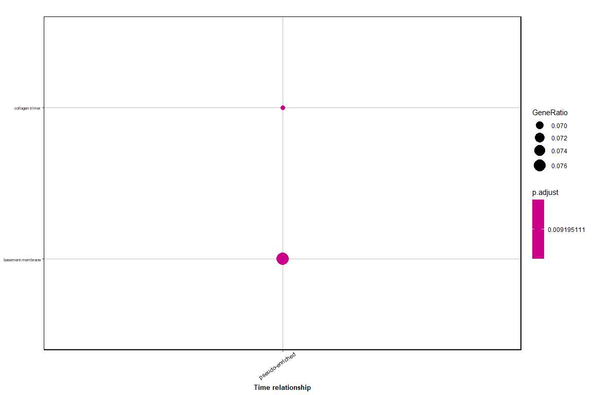<!-- -->

``` r
ggsave(plot = go_cc_lung_dotplot, 
       filename = here::here("figures/enrichment_dotplot_plot_lungCC.tiff"), 
       device = "tiff",
       units = "mm",
       width = 85,
       height = 70)
```

``` r
ggsave(plot = go_cc_lung_dotplot, 
       filename = here::here("figures/enrichment_dotplot_plot_lungCC.eps"), 
       device = "eps",
       units = "mm",
       width = 85,
       height = 70)
```

### <GO:BP> - Lung

``` r
func_enrich_lung_bp <- compareCluster(ID~Time_relation, 
                                       data=top_table_lung, 
                                       fun="enrichGO",
                                       OrgDb = org.Hs.eg.db,
                                       keyType = "UNIPROT",
                                       ont = "BP",
                                       pvalueCutoff = 0.05,
                                       pAdjustMethod = "BH", 
                                       qvalueCutoff = 0.2,
                                       minGSSize = 10,
                                       maxGSSize = 800,
                                       readable = FALSE,
                                       pool = FALSE,
                                       universe = universe_lung)
```

### Structural domain-based enrichment

#### Super family

``` r
func_enrich_lung_supfam <- compareCluster(ID~Time_relation, 
                                       data=top_table_lung, 
                                       fun="enricher",
                                       pvalueCutoff = 0.05,
                                       pAdjustMethod = "BH", 
                                       qvalueCutoff = 0.2,
                                       minGSSize = 10,
                                       maxGSSize = 800,
                                       universe = universe_lung,
                                       TERM2GENE = supfam2protein_id)
```

-   SSF57196: Class: Small proteins; Fold: Knottins (small inhibitors,
    toxins, lectins); Superfamily: EGF/Laminin.

``` r
supfam_lung_dotplot <- enrichplot::dotplot(func_enrich_lung_supfam, x = "Time_relation") +
          xlab("Time relationship") +
          theme(axis.text.x = element_text(hjust = 0.7, vjust = 0.8, size=8, angle = 35),
                axis.text.y = element_text(size=6),
                panel.background = element_blank(),
                panel.grid.major = element_line(color = "grey"),
                panel.border = element_rect(colour = "black", fill=NA, size=1),
                #legend.position = "none",
                axis.title.y = element_blank(),
                axis.title=element_text(size=10,face="bold"),
                          strip.background = element_blank(),
                          strip.text.x = element_text(size = 12, margin = margin(3,3,3,3, "mm")))
```

``` r
supfam_lung_dotplot
```

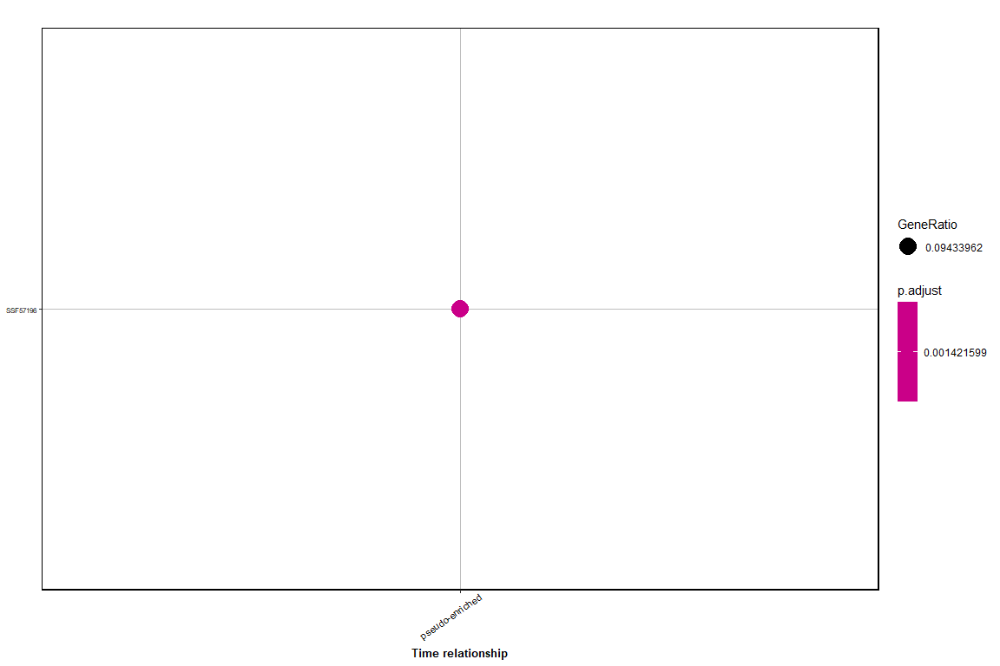<!-- -->

``` r
ggsave(plot = supfam_lung_dotplot, 
       filename = here::here("figures/enrichment_dotplot_plot_lungSUPFAM.tiff"), 
       device = "tiff",
       units = "mm",
       width = 85,
       height = 70)
```

``` r
ggsave(plot = supfam_lung_dotplot, 
       filename = here::here("figures/enrichment_dotplot_plot_lungSUPFAM.eps"), 
       device = "eps",
       units = "mm",
       width = 85,
       height = 70)
```
